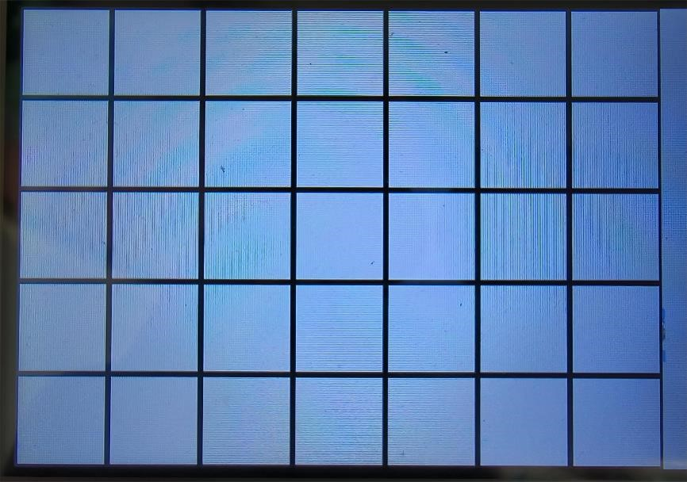

# TankWar

***

## 项目介绍 Project introduction
BUAA  2023秋单片机基础大作业

使用STM32G474RE开发板，配合助教 zyy 的 PCB 板实现 **坦克动荡** 游戏

## 项目贡献者 contributors
* 张尚谋
* 王博冉
* 曾楚翔
* copilot
* zyy - 助教
* ywth - 助教

## 文件结构 file structure


## 文件介绍 file introduction
|      文件名      |     功能     |  主要贡献者  |
|:-------------:|:----------:|:-------:|
|     main      |   各板载外设    | CubeMx  |
|     audio     |   音频宏定义    |   zyy   |
|    global     | 通用类型、宏、函数等 |   张尚谋   |
| lever_control |    摇杆映射    |   曾楚翔   |
|    record     | EEPROM 存档  |   曾楚翔   |
|     touch     |   触屏信息读取   |   王博冉   |
|     sound     |    音频播放    |   曾楚翔   |
|     crash     |    碰撞类型    |   王博冉   |
|  lcd_driver   |   LCD 驱动   | zyy、张尚谋 |
|      map      | 地图生成、撞墙判断  |   张尚谋   |
|   showScore   |    分数显示    |   曾楚翔   |
|     tank      |    坦克实现    |   张尚谋   |
|    bullet     |    子弹实现    |   王博冉   |
|     laser     |  2p 激光实现   |   张尚谋   |
|    target     |  1p 靶子实现   |   王博冉   |
|   mainMenu    |   主菜单逻辑    |   张尚谋   |


## 实现细节 implementation details

### 1. 地图生成 map generation
* 地图由 `5 * 7` 个 Box 组成，每个 Box `64 * 64` 像素，地图共占 `320 * 448` 像素



* 每个Box 周围一周为墙，墙的宽度为 `2` 像素，墙的颜色为 `0x0000`


* 每个Box 的结构类型为 `Box_T`, 如下

```c
typedef struct {
    uint8_t up: 1; // if box up is wall ? 0 : 1
    uint8_t down: 1; // if box down is wall ? 0 : 1
    uint8_t left: 1; // if box left is wall ? 0 : 1
    uint8_t right: 1; // if box right is wall ? 0 : 1
    uint8_t : 4; // preserved for memory alignment
    uint8_t id; // box id
    uint8_t x: 4; // box x (top left corner)
    uint8_t y: 4; // box y (top left corner)
} Box_T;
```

* 生成地图采用 `Prim` 算法，每次随机选取一个Box，将其周围的墙打通，直到所有Box都被访问过

```Fake
[def: 墙内侧 -> Box 已被访问过的一侧]
[def: 墙外侧 -> Box 未被访问过的一侧]

BEGIN:

将地图边缘的墙标记为 已打通 // 边缘保护

将 左上角 Box 标记为 已访问
将地图左上角 Box 周围的、未打通的墙按照 [墙内侧, 墙外侧] 的格式加入 集合 S 中
while( S 非空 )
    从 S 中随机选取一面墙 w
    if ( 墙外侧 已被访问 ) // 该墙已经打通
        continue
    else
        打通墙 w //将墙内外侧 Box 的 [up/left/down/rigt] 标记为 1
        将 墙外侧 Box 标记为 已访问
        将 墙外侧 Box 周围的未打通的墙按照 [墙内侧, 墙外侧] 的格式加入 集合 S 中

将地图边缘的墙标记为 未打通 // 消除边缘保护

END.
```