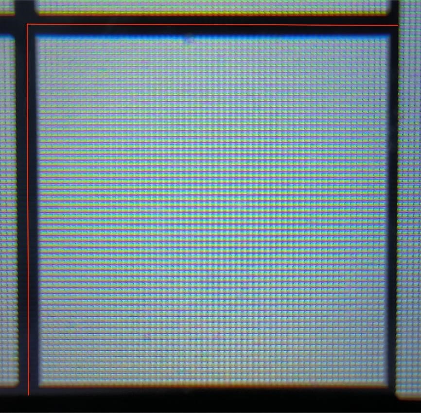

# TankWar

***

## 项目介绍 Project introduction
BUAA  2023秋单片机基础大作业

使用 **NUCLEO-G474RE** 开发板，配合助教 zyy 的 PCB 板实现 **坦克动荡** 游戏

## 项目贡献者 contributors
* 张尚谋
* 王博冉
* 曾楚翔
* copilot
* zyy - 助教
* ywth - 助教

## 文件结构 file structure


## 文件介绍 file introduction
|      文件名      |     功能     |  主要贡献者  |
|:-------------:|:----------:|:-------:|
|     main      |   各板载外设    | CubeMx  |
|     audio     |   音频宏定义    |   zyy   |
|    global     | 通用类型、宏、函数等 |   张尚谋   |
| lever_control |    摇杆映射    |   曾楚翔   |
|    record     | EEPROM 存档  |   曾楚翔   |
|     touch     |   触屏信息读取   |   王博冉   |
|     sound     |    音频播放    |   曾楚翔   |
|     crash     |    碰撞类型    |   王博冉   |
|  lcd_driver   |   LCD 驱动   | zyy、张尚谋 |
|      map      | 地图生成、撞墙判断  |   张尚谋   |
|   showScore   |    分数显示    |   曾楚翔   |
|     tank      |    坦克实现    |   张尚谋   |
|    bullet     |    子弹实现    |   王博冉   |
|     laser     |  2p 激光实现   |   张尚谋   |
|    target     |  1p 靶子实现   |   王博冉   |
|   mainMenu    |   主菜单逻辑    |   张尚谋   |


## 技术难点及实现方案 technical difficulties and the solutions

### 1. 地图生成  map generation
* 地图由 `5 * 7` 个 Box 组成，每个 Box `64 * 64` 像素，地图共占 `320 * 448` 像素


* 每个Box 周围一周为墙，墙的宽度为 `2` 像素，墙的颜色为 `0x0000`



* 每个Box 的结构类型为 `Box_T`, 如下

```c
typedef struct {
    uint8_t up: 1; // if box up is wall ? 0 : 1
    uint8_t down: 1; // if box down is wall ? 0 : 1
    uint8_t left: 1; // if box left is wall ? 0 : 1
    uint8_t right: 1; // if box right is wall ? 0 : 1
    uint8_t : 4; // preserved for memory alignment
    uint8_t id; // box id
    uint8_t x: 4; // box x (top left corner)
    uint8_t y: 4; // box y (top left corner)
} Box_T;
```

* 生成地图采用 `Prim` 算法，每次随机选取一个Box，将其周围的墙打通，直到所有Box都被访问过

```Fake
[def: 墙内侧 -> Box 已被访问过的一侧]
[def: 墙外侧 -> Box 未被访问过的一侧]

BEGIN:

将地图边缘的墙标记为 已打通 // 边缘保护

将 左上角 Box 标记为 已访问
将地图左上角 Box 周围的、未打通的墙按照 [墙内侧, 墙外侧] 的格式加入 集合 S 中
while( S 非空 )
    从 S 中随机选取一面墙 w
    if ( 墙外侧 已被访问 ) // 该墙已经打通
        continue
    else
        打通墙 w //将墙内外侧 Box 的 [up/left/down/right] 标记为 1
        将 墙外侧 Box 标记为 已访问
        将 墙外侧 Box 周围的未打通的墙按照 [墙内侧, 墙外侧] 的格式加入 集合 S 中

将地图边缘的墙标记为 未打通 // 消除边缘保护

END.
```

### 2. 物体移动  object movement
* 实际情况中，坦克、子弹等应该具有 360° 连续的方向，但是考虑到单片机有限的计算能力和存储空间，我们将 360° 的空间平均分为 20 份，
    即每份 18°，将方向分为 20 个方向，分别为 `0°, 18°, 36°, ..., 342°`


* 在较高帧率 ( 本项目为 60 FPS ) 的条件下，每刷新`T`次 ，沿某个方向平均速度，可近似表示为下图最后一项：

    


* 画出函数图像大致为下图：
    
    

* 因此，只需要为每个方向设计一个周期性的 `directionAdd(direction, t)` 位置增量函数，让各个方向的增量函数在**一个周期内，位置增量和的模  的平均值近似相等**即可，项目中设计了一个`getDirectionAdd`函数
，可以在近似满足条件的情况下，保证各方向增量正切值的精确度，如下：

    ```c
    #define DIRECTION_FIRST_DIM_LEN 5
    
    DirectionAdd_T getDirectionAdd(uint8_t *subscript ,uint8_t newDirection) {
        // 26 * 38   0° ->         y+=-1 ,       y+=-2
        // 32 * 40  18° ->         y+=-2 , x+=-1 y+=-1
        // 38 * 40  36° ->   x+=-1 y+=-1 , x+=-1 y+=-2 , x+=-1 y+=-1
        // 40 * 38  54° ->   x+=-1 y+=-1 , x+=-2 y+=-1 , x+=-1 y+=-1
        // 40 * 32  72° ->   x+=-1       , x+=-2 y+=-1
        static const DirectionAdd_T directionAdd[DIRECTION_FIRST_DIM_LEN][3] = {
                {{0,  -1}, {0,  -2}, {0,  0}},  // T = 2   0°  tan  0° ≈ 0/3
                {{0,  -2}, {-1, -1}, {0,  0}},  // T = 2  18°  tan 18° ≈ 1/3
                {{-1, -1}, {-1, -2}, {-1, -1}}, // T = 3  36°  tan 36° ≈ 3/4
                {{-1, -1}, {-2, -1}, {-1, -1}}, // T = 3  54°  tan 54° ≈ 4/3
                {{-1, 0},  {-2, -1}, {0,  0}},  // T = 2  72°  tan 72° ≈ 3/1
        };
        ...
        return DirectionAdd_T{xAdd, yAdd}};
    }
    ```
  * 由于各个方向具有设置的方向具有对称性，我们只设置的 `0~72` 度的增量函数，其他方向的增量函数通过对称变换得到（此过程已省略）
  * 传入的`newDirection`、`subscript`参数可分别理解为`directionAdd(direction, t)`函数的参数`t`、`direction`
  * 为了保证各物体移动的独立性， `newDirection`、`subscript`分别定义在各物体的结构体中，类似于：
    ```c
    typedef struct Object_T{
        ...
        uint8_t subscript[DIRECTION_FIRST_DIM_LEN]; // pace
        ...
        uint8_t direction;
        ...
    }Object_T;
    ```

### 3. 碰撞检测  crash test

* 本项目对于碰撞有两种处理：
  * 以图片边缘为碰撞检测点（如：激光击中坦克）
    * 优点：较好实现，算力开销小，普适性好，保证图片与墙体的绝对分离
    * 缺点：实现效果较为粗糙
      * 例如 36° 的坦克图片白边较大，子弹碰撞坦克时在视觉上还有一定的距离，游戏体验较差
  * 在图片取一定数量的点用于碰撞检测（如：子弹击中坦克、子弹和激光的反弹等）
    * 优点：视觉效果好
    * 缺点：较难实现，算力开销大；只能抽样检测，普适性差
      * 例如，判断激光是否击中坦克时，激光非常细，要保证碰撞检测的准确度，只能增加采样点的数量，得不偿失

#### 实现方案：
* 对于 “以图片边缘为碰撞检测点” 的方案，实现较为简单，以 “激光击中坦克”例，只需判断激光方块 ( 2pt * 2pt ) 的左上角点坐标是否在坦克图片的区域中即可
* 对于 “在图片取一定数量的点用于碰撞检测”的方案，以“子弹撞击坦克”为例，实现方法大致如下：
  * 在每张坦克图像坐标系中，沿坦克躯干边缘取若干坐标点
  * 每一帧，遍历所有坐标点，检测是否有点落在子弹的图像范围中，若有则子弹集中了坦克


### 4. 子弹 / 激光反弹  bullet / laser bounce

* 检测下一帧 子弹/激光 按照原方向运动是否会撞墙，若会，则改变 子弹/激光 运动的方向